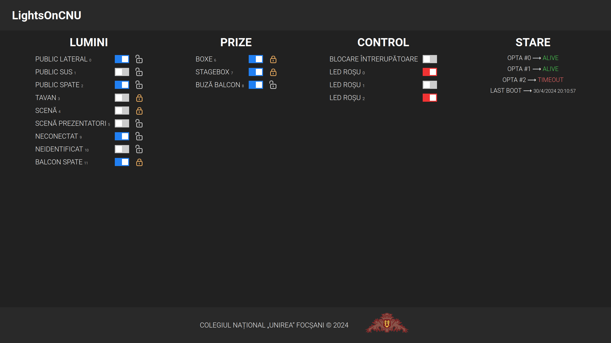
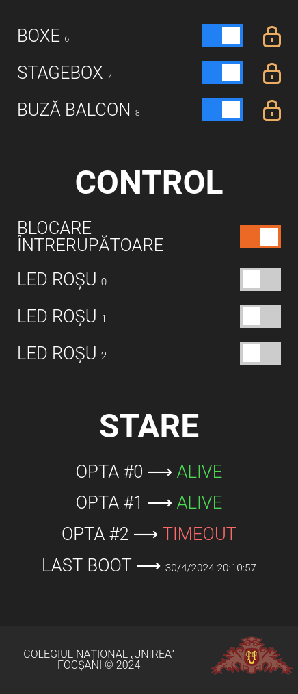

# LightsOnCNU

LightsOnCNU este o aplicație web creată pentru a controla luminile din sala de festivități a Colegiului Național „Unirea” Focșani.

## Scopul proiectului

Înainte de modernizarea sălii de festivități, controlul luminilor se realiza doar de la întrerupătoare, iar amplasarea acestora îngreuna desfășurarea evenimentelor din sala de festivități. Astfel, ne-am folosit de [PLC](https://en.wikipedia.org/wiki/Programmable_logic_controller)-uri [Arduino Opta](https://www.arduino.cc/pro/hardware-arduino-opta/) cu capabilități Ethernet pentru a face posibil controlul luminilor și de la distanță. Am ales să folosim un Raspberry Pi ca server central pentru a transmite și primi date de la dispozitivele Arduino Opta și am creat un site web pentru a oferi o utilizatorilor o experiență interactivă.

## Instalare

Clonează repository-ul proiectului
```bash
git clone https://github.com/brickbotcnu/lights-on-cnu.git
```

Intră în folderul server-ului
```bash
cd lights-on-cnu/server/
```

Descarcă și instalează [Node.js](https://nodejs.org/en/download) dacă acesta nu este instalat

Instalează modulele necesare
```bash
npm i express socket.io net-ping
```

Pornește server-ul
```bash
node main.js
```

Modulul `net-ping`, folosit pentru a verifica dacă PLC-urile pot fi accesate din rețea, are nevoie de drepturi de administrator pentru a rula

Webserver-ul poate fi accesat la adresa [http://localhost:8080/](http://localhost:8080/)

## Tehnologii folosite

Pentru comunicarea dintre Server și Arduino, am creat un protocol bidirecțional de comunicare, bazat pe [AES](https://en.wikipedia.org/wiki/Advanced_Encryption_Standard)-256-[CBC](https://en.wikipedia.org/wiki/Block_cipher_mode_of_operation) pentru criptarea mesajului și pe [HMAC](https://en.wikipedia.org/wiki/HMAC)-SHA256 pentru a dovedi autenticitatea mesajului, realizând în acest mod un protocol sigur. Datele sunt transmise și primite prin socket-uri TCP.

Codul pentru Arduino este scris în C și utilizează următoarele implementări pentru a asigura funcționarea protocolului de comunicare:
- [kokke/tiny-AES-c](https://github.com/kokke/tiny-AES-c)
- [h5p9sl/hmac_sha256](https://github.com/h5p9sl/hmac_sha256)

Server-ul este scris în Node.js și folosește [Express](https://expressjs.com/) pentru webserver și [Socket.IO](https://socket.io/) pentru comunicarea în timp real dintre webserver și utilizatorii web.

## Aspect





## Funcționalități website
- Închiderea și deschiderea releelor ce controlează lumini ori prize
- Controlul luminilor prin întrerupătoare, actualizând totodată starea releelor pe website
- Blocarea sau deblocarea unui releu (iconița cu lacăt) în starea setată. Astfel, releul nu mai poate fi închis sau deschis de la întrerupător. Această funcție este folosită în special pentru prizele care trebuie să fie pornite în marea parte a timpului și pot fi dezactivate doar de persoanele care au acces la website
- Blocarea tuturor releelor printr-un buton, atunci când controlul se face doar de la distanță de către departamentul tehnic, în timpul evenimentelor
- Website responsive
- Afișarea stării fiecărui PLC Arduino Opta în timp real
- Afișarea datei și orei la care server-ul a bootat, folositoare în cazul identificării unei pene de curent

## Protocolul de comunicare

### Mesaje

În C++, am definit următoarele structuri pentru a reprezenta mesajele trimise de Arduino și pe cele trimise de Server:

```c++
struct ArduinoMessage {  // mesaj trimis de PLC-ul Arduino Opta
    uint32_t counter;    // contor
    uint32_t timestamp;  // timpul Unix la momentul trimiterii
    uint8_t arduino_id;  // ID-ul PLC-ului
    uint8_t type;        // tip mesaj
    uint8_t extra_field; // câmp extra
} __attribute__((packed));

struct ServerMessage {   // mesaj trimis de Server
    uint32_t counter;
    uint32_t timestamp;
    uint8_t type;
    uint8_t extra_field;
} __attribute__((packed));
```

Structurile au atributul `packed` deoarece compilatoarele C/C++ inserează baiți în plus între câmpurile structurilor, pentru a "alinia" adresele din memorie ale câmpurilor și a crește performanța atunci când memoria este accesată. [Wikipedia](https://en.wikipedia.org/wiki/Data_structure_alignment) - Data structure alignment.

În acest caz, ne dorim un șir de baiți consecutivi pentru a facilita serializarea și deserializarea mesajelor, fără baiți de aliniament.
- în C++, prin cast-ul unui array de tipul `uint8_t[]` la una dintre structurile definite mai sus și viceversa
- în Node.js, folosind clasa [`Buffer`](https://nodejs.org/api/buffer.html)

Tipurile mesajelor sunt definite în felul următor:
```c++
enum ArduinoMessageType {casting
    // noile stări ale releelor ce controlează luminile
    ARDUINO_SET_RELAYS = 0
};

enum ServerMessageType {
    // dacă un utilizator pornește/oprește un releu de pe website,
    // PLC-ul Arduino Opta trebuie înștiințat pentru a efectua schimbarea
    SERVER_SET_RELAYS = 0,
    // blocarea unui întrerupător, pentru a preveni acționarea
    // accidentală în timpul unui eveniment
    SERVER_SET_LOCKS = 1
};
```

Câmpul `type` va avea una dintre aceste valori.

Câmpul `extra` depinde de valoarea câmpului `type`. În cazul unui mesaj de natură a seta starea releelor, bit-ul `N` al acestui câmp va reprezenta starea releului `N`, astfel, 0 = circuit deschis și 1 = circuit închis. Fiecare PLC Arduino Opta dispune de 4 relee, deci acest câmp folosește doar 4 biți din byte-ul întreg. Similar, în cazul mesajelor de tip `SERVER_SET_LOCKS`, vom folosi ultimii 4 biți pentru a comunica PLC-ului starea de blocare a celor 4 relee, 0 = releu deblocat și 1 = releu blocat.

Folosim un contor al mesajelor trimise, iar la crearea unui mesaj nou acesta va reprezenta câmpul `counter`, urmând ca după trimitere variabila locală să fie incrementată cu o unitate.

Câmpul `timestamp` este timpul local în format Unix la momentul trimiterii mesajului.

Câmpul `arduino_id` este prezent doar în cadrul unui mesaj trimis de Arduino și este folosit de Server pentru a identifica PLC-ul de la care a venit mesajul. Reprezintă ID-ul PLC-ului care a trimis mesajul.

În Node.js protocolul este același, iar singurele diferențe sunt sintaxa și modul de (de)serializare a mesajelor, care se face folosind clasa `Buffer`, de exemplu:

```js
class ArduinoMessage {
    #counter;    // 4 baiți
    #timestamp;  // 4 baiți
    #arduinoId;  // 1 bait
    #type;       // 1 bait
    #extraField; // 1 bait

    constructor(buffer) {    // deserializarea unui mesaj primit sub formă de Buffer
        this.#counter    = buffer.readUInt32LE(0); // 0
        this.#timestamp  = buffer.readUInt32LE(4); // +4
        this.#arduinoId  = buffer.readUInt8(8);    // +4
        this.#type       = buffer.readUInt8(9);    // +1
        this.#extraField = buffer.readUInt8(10);   // +1
    }

    getCounter() { return this.#counter }
    /* getTimestamp(), getArduinoId(), ... */
}
```

### Crearea unui mesaj

Vom considera drept exemplu următorul mesaj `ArduinoMessage` și cast-ul acestuia la un array de baiți:

```c++
struct ArduinoMessage arduino_msg = {
    // aceste câmpuri sunt setate dinamic, dar pentru scopul acestui exemple
    // am ales valori concrete
    .counter = 1932,
    .timestamp = 1714576902,
    .arduinoId = 2,
    .type = ARDUINO_SET_RELAYS,
    .extra = 0b1101
};

uint8_t *byte_array = (uint8_t *) &arduino_msg;
```

Valorile din byte-array sunt `8c 07 00 00 06 5e 32 66 02 00 0d`.

**Notă**: Ordinea de transmitere a baiților este **little-endian**. Citește mai mult despre [endianness](https://en.wikipedia.org/wiki/Endianness).

Primii 4 baiți `8c 07 00 00` reprezintă câmpul `counter`.

Câmpul `timestamp` este reprezentat de următorii 4 baiți: `06 5e 32 66`.

După primii 8 baiți, urmează baiții `02 00 0d`, ce reprezintă, în această ordine:
- ID-ul PLC-ului Arduino ce a trimis mesajul, aici `0x2` = 2
- Tipul mesajului, aici `0x0` = `ARDUINO_SET_RELAYS`
- Valorea câmpului extra, aici `0xd` = `0b00001101` (releul 0 închis, releul 1 deschis, ...)

AES criptează date în block-uri de câte 16 baiți, așa că mesajele trebuie mai întâi aduse la o dimensiune, în baiți, multiplu de 16. În acest sens, am folosit standardul [PCKS#7](https://www.ibm.com/docs/en/zos/2.4.0?topic=rules-pkcs-padding-method).

Pentru modul CBC al algoritmului AES, avem nevoie și de un IV (initialization vector), pe care îl generăm cu funcția `rand()` în C++ și funcția `randomBytes()` din biblioteca [Crypto](https://nodejs.org/api/crypto.html#cryptorandombytessize-callback) în Node.js.

Cheile criptografice ale algoritmilor AES și HMAC sunt pre-shared.

Pe exemplul precedent, criptând mesajul cu:
- `iv` = `73a42edf0df1a14e0dcba9c509efa2e9`
- `aes_key` = `94aa4307...`

Obținem criptarea `ciphertext` = `59dec599...`.

Urmează să calculăm hash-ul pentru a garanta autenticitatea mesajului când el va fi decriptat. Folosim metoda **Encrypt-then-MAC**. [Citește mai mult](https://crypto.stackexchange.com/a/205).

Funcția HMAC-SHA256 va primi ca date de intrare șirul de baiți `iv || ciphertext`, format prin concatenarea IV-ului și a mesajului criptat.

Cheia va fi `hmac_key` = `c0823c73...`

Obținem hash-ul `hash` = `2ebfda2b...`

Acum putem transmite șirul de baiți `iv || ciphertext || hash` către Server.

Vezi [aici](...) valorile complete ale cheilor și datele de ieșire ale algoritmilor, pentru acest exemplu.

Ca rezumat, pentru a trimite un mesaj, generăm un IV aleatoriu și criptăm mesajul cu AES. Concatenăm IV-ul și mesajul criptat și acești baiți vor fi datele de intrare pentru funcția HMAC-SHA256. La final, transmitem IV-ul, mesajul criptat și hash-ul concatenate.

### Transmiterea unui mesaj

Se realizează folosind socket-uri TCP.

Port-ul folosit de socket-urile PLC-urilor pentru a primi mesaje este `9090`, iar Server-ul folosește port-ul `9091`.

### Validarea unui mesaj primit

Ne vom folosi de o variabilă ce contorizează numărul mesajelor primite.

1. Se verifică ca lungimea mesajului să fie multiplu de 16 baiți.

2. Se fragmentează mesajul în felul următor:
- primii 16 baiți = `iv`
- ultimii 32 baiți = `received_hash`
- restul baiților = `ciphertext`

3. Calculăm hash-ul pentru `iv || ciphertext` și verificăm egalitatea dintre acesta și `received_hash`, pentru a dovedi autenticitatea mesajului.

    Notă: Comparând hash-ul calculat și cel primit, au fost folosite funcții timing-safe pentru a nu face protocolul vulnerabil unui [timing attack](https://en.wikipedia.org/wiki/Timing_attack).

4. Decriptăm mesajul, folosind cheia AES pre-shared și `iv`-ul primit.

5. Câmpul `counter` al mesajului trebuie să fie strict mai mic decât contorul mesajelor primite

6. Modului diferenței dintre timpul local de la momentul primirii și câmpul `timestamp` trebuie să fie de cel mult 5 secunde.

    La primirea unui mesaj, validarea câmpurilor `counter` și `timestamp` asigură protecție împotriva unui [replay attack](https://en.wikipedia.org/wiki/Replay_attack).

    Notă: Deși mesajul este creat și apoi primit, așadar diferența ar trebui să fie pozitivă ori nulă, datorită inacurateții RTC-ului PLC Arduino Opta, am dedus experimental că această diferență poate fi și negativă, în jur de -2 secunde. Calibrăm RTC-ul la un interval de timp mai mic și calculăm *modulul* diferenței pentru a rezolva această problemă.

7. Orice verificare eșuată înseamnă ignorarea mesajului, considerându-l invalid. Dacă toate condițiile au fost îndeplinite, mesajul este valid și acum poate fi considerat sigur. **Nu** uităm să incrementăm contorul mesajelor primite.

## Webserver și Socket.IO

### Pentru Server

Pentru comunicarea în timp real dintre webserver și utilizatorii web, folosim modulul [Socket.IO](https://socket.io/) din Node.js. Socket.IO este o bibliotecă ce asigură comunicarea cu latență scăzută, bidirecțională și **event-based** între un client și un server.

Serverul păstrează în memorie starea tuturor releelor, deschise/închise și blocate/deblocate, și execută comenzi `ping`, la un interval de timp regulat, pentru a verifica și actualiza starea PLC-urilor.

Când un întrerupător este acționat, PLC-ul responsabil va închide sau deschide releul corespunzător și va trimite un mesaj către Server pentru a comunica noua stare a releului, iar Serverul va înregistra schimbarea.

Serverul poate emite 5 tipuri de event-uri, ce vor modifica în timp real pagina web în felul următor:

| Nume                        | Efect |
| -----                       | ----- |
| `SERVER_SET_RELAYS`         | modifică starea releelor |
| `SERVER_SET_LOCKS`          | modifică starea de blocare a releelor |
| `SERVER_SET_LOCK_ALL`       | activează/dezactivează funcția ce blochează toate releele |
| `SERVER_SET_ARDUINO_STATES` | modifică stările PLC-urilor Arduino Opta |
| `SERVER_SET_LAST_BOOT`      | modifică data și ora la care Serverul a bootat |

La încărcarea paginii web, clientul se va conecta la server-ul Socket.IO, iar serverul va emite toate aceste 5 event-uri pentru a comunica aceste valori la momentul conectării.

După conexiune, aceste event-uri vor fi emise de Server doar atunci când este necesar:
- pentru a comunica noua stare a unui releu după acționarea unui întrerupător
- pentru a transmite schimbările efectuate de alți utilizatori prin intermediul website-ului (închiderea/deschiderea unui releu, blocarea/deblocarea acestuia sau blocarea tuturor releelor)
- pentru a actualiza starea unui PLC

### Pentru utilizatori

Când un utilizator efectuează o schimbare, codul Javascript al paginii va emite, către Server, unul dintre aceste 3 event-uri:

| Nume                  | Efect |
| -----                 | ----- |
| `CLIENT_SET_RELAY`    | modifică starea unui releu |
| `CLIENT_SET_LOCK`     | modifică starea de blocare a unui releu |
| `CLIENT_SET_LOCK_ALL` | activează/dezactivează funcția ce blochează toate releele |

Server-ul înregistrează aceste schimbări, le transmite către ceilalți utilizatori și trimite mesaje către PLC-uri.

## Structură foldere

```bash
.
├── arduino_opta     # Cod Arduino [C++]
└── server           # Cod Server [Node.js]
    ├── arduinoOpta  # Abstractizarea PLC-urilor Arduino Opta
    │   ├── comm     # Implementarea protocolului de comunicare
    ├── expressApp   # Webserver Express
    │   ├── middlewares
    │   ├── routes
    │   ├── static   # Fișiere statice (.css, .js, .svg)
    │   └── views
    │       └── home.html  # Pagina HTML principală
    ├── logging.js
    ├── main.js
    └── socketIoApp.js  # Aplicația Socket.IO
```
